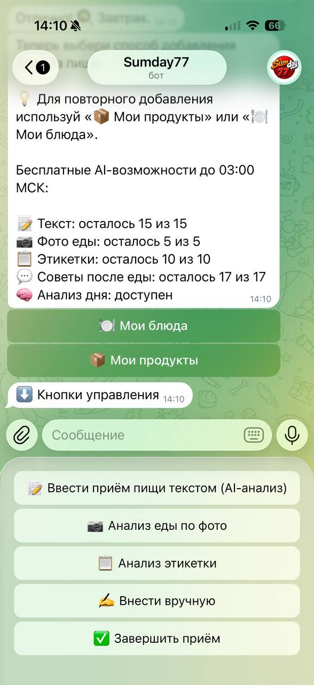
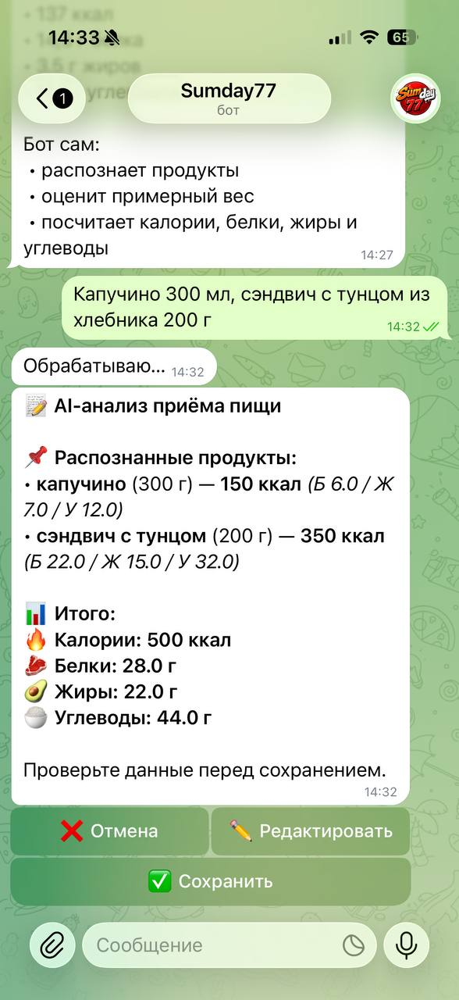
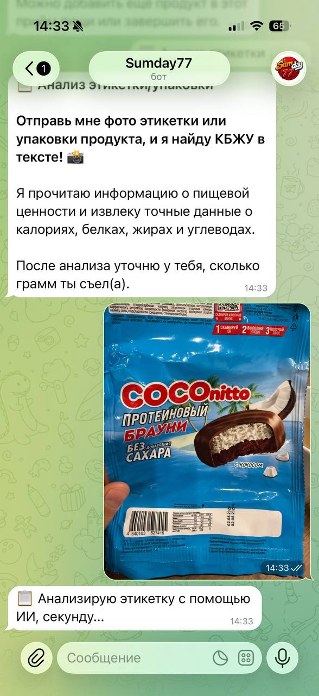
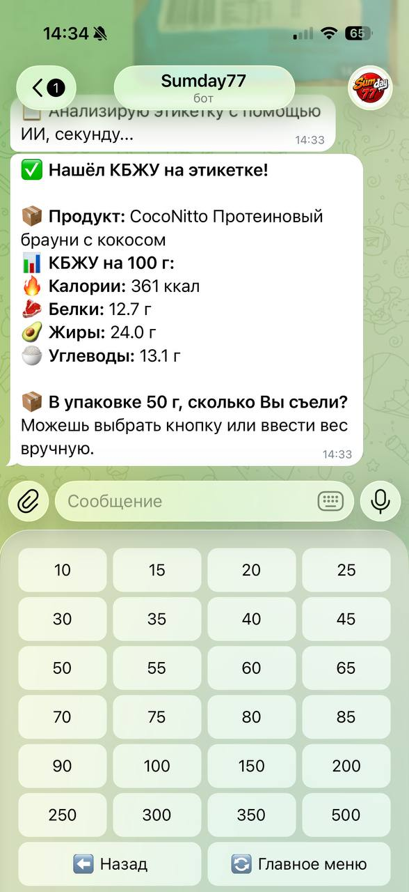
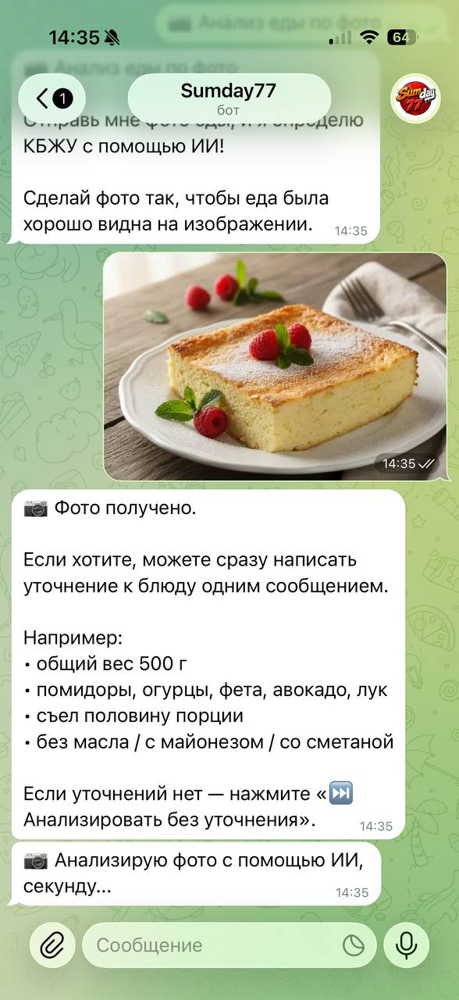
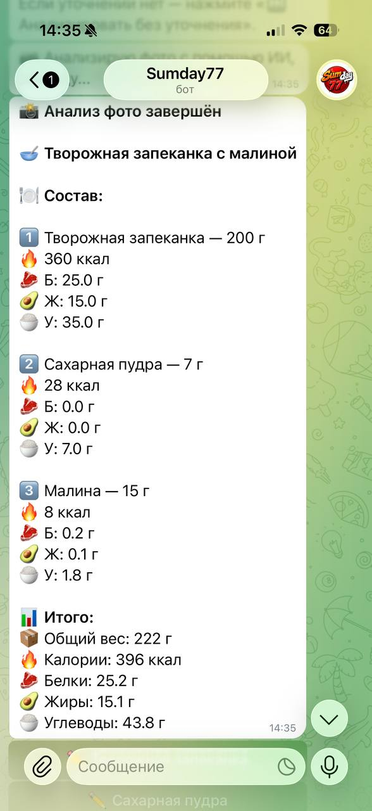
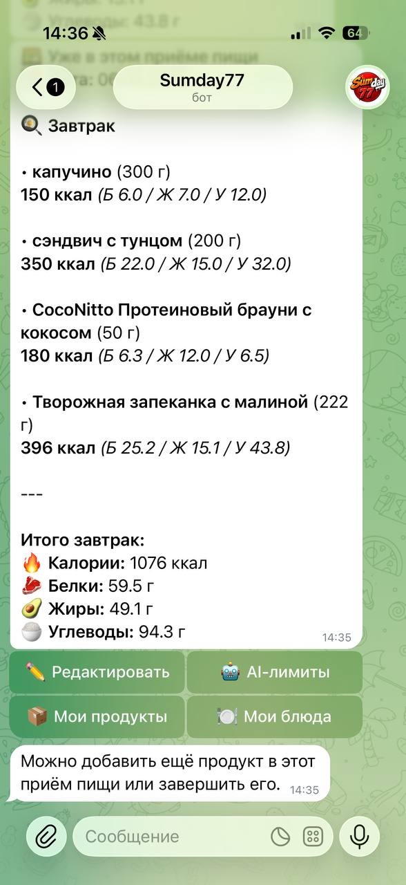
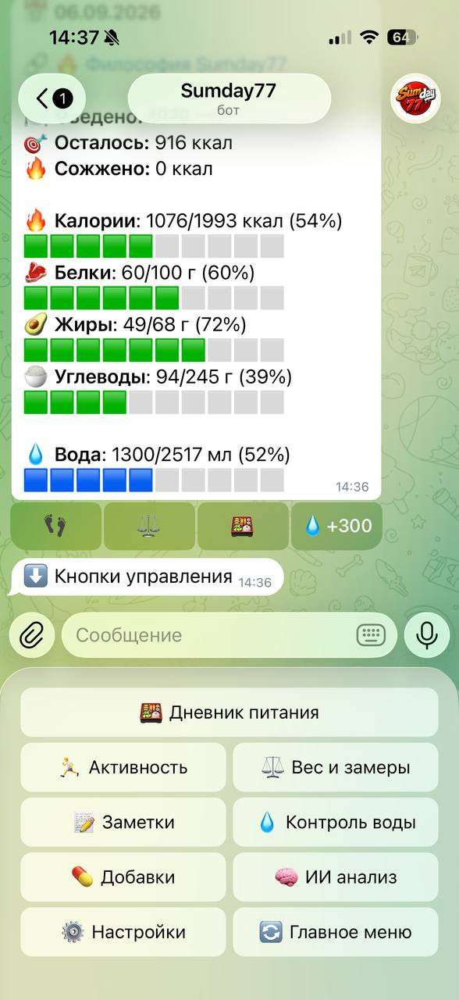

# Sumday77

AI-powered Telegram assistant for nutrition, physical activity and personal fitness tracking.

Sumday77 combines a Python backend, persistent user data, computer vision, OCR and multiple AI providers to analyze food, product labels and daily activity while maintaining structured user history.

The project is actively developed as a full software product rather than a single-purpose bot.

## Product demo

### AI-assisted nutrition workflows

The application supports several AI-assisted input scenarios, including text-based meal analysis, food-photo analysis and nutrition-label recognition.

<p align="center">
  
  
  
</p>

### Vision and structured extraction

Nutrition-label analysis extracts structured calories and macronutrients from a photographed package, while food-photo analysis identifies dishes and estimates composition and portion-related nutrition data.

<p align="center">
  
  
  
</p>

### Product workflow and personal tracking

Recognized data can be saved into the user's meal flow, summarized, analyzed and combined with daily nutrition and hydration tracking.

<p align="center">
  
  
  
</p>

## What it can do

### AI-powered nutrition analysis

* Analyze food from photos using vision models
* Extract nutrition information from product labels
* Process food descriptions provided as text
* Return structured calories and macronutrient data
* Validate and normalize AI-generated structured responses
* Use OCR as part of label-processing workflows

### Activity and fitness tracking

* Track workouts and exercises
* Record different activity input types such as time, distance and repetitions
* Track weight and body measurements
* Track water intake
* Maintain workout and activity history
* Generate daily activity summaries

### Personal tracking

* Nutrition diary
* Weight history
* Water tracking
* Supplement tracking and reminders
* Well-being notes
* Personal activity history
* Interactive calendar-based navigation

## AI integration

The application integrates several AI providers and isolates them behind dedicated service layers.

Current integrations include:

* OpenAI
* Google Gemini
* DeepSeek
* Yandex AI

The project includes:

* image and vision requests
* structured JSON output processing
* provider-specific error handling
* fallback logic
* request quota management
* token and usage tracking
* input validation
* logging with sensitive-data sanitization

## Architecture

The application follows a modular service-oriented structure.

```text
sumday77/
├── handlers/          # Telegram interaction flows
├── services/          # Business logic and external AI services
├── database/          # SQLAlchemy models, sessions and repositories
├── middlewares/       # Telegram middleware
├── states/            # aiogram FSM states
├── utils/             # Validation, formatting and shared utilities
├── tests/             # Automated tests
├── .github/workflows/ # CI configuration
├── config.py          # Environment-based configuration
├── main.py            # Application entry point
└── Dockerfile
```

The codebase separates Telegram handlers, persistence, AI integrations and business logic to reduce coupling and make features easier to test and extend.

## Technology stack

### Backend

* Python 3.11
* aiogram 3
* SQLAlchemy 2
* PostgreSQL
* asynchronous Python

### AI and image processing

* OpenAI API
* Google Gemini
* DeepSeek
* Yandex AI
* Tesseract OCR
* Pillow

### Infrastructure

* Docker
* Git
* GitHub Actions
* Linux deployment
* PostgreSQL advisory locks

## Reliability and production-oriented features

Sumday77 includes several mechanisms intended to make the application safer and more reliable in real-world operation:

* centralized configuration through environment variables
* structured logging
* sensitive-data sanitization
* AI usage logging
* API quota management
* AI provider fallback handling
* retry and cooldown mechanisms
* PostgreSQL connection handling
* protection against multiple Telegram polling instances using PostgreSQL advisory locks
* background notification scheduling
* health-check endpoint
* account-data deletion flow
* automated tests
* Docker image build checks through GitHub Actions

## Computer vision workflow

One of the main AI scenarios is food and product-label analysis.

A typical flow is:

```text
Telegram image
      ↓
Image validation
      ↓
OCR / Vision model
      ↓
Structured AI response
      ↓
JSON validation and normalization
      ↓
Nutrition data
      ↓
Database
      ↓
User diary
```

For vision requests, the application can send the original image to multimodal models and process structured responses rather than relying only on plain-text generation.

## Data layer

Persistence is implemented with SQLAlchemy.

The project uses repository-style access for major entities such as:

* meals
* workouts
* activities
* weight
* water
* supplements
* saved products
* AI usage
* user settings

PostgreSQL is used in production-oriented scenarios, while the configuration also supports a local SQLite database for development.

## Privacy-related engineering

The application works with personal tracking data, so the codebase includes dedicated privacy and cleanup mechanisms.

Examples include:

* removal of user-associated database records
* verification that account deletion is complete
* sanitization of sensitive text before technical logging
* retention logic for technical logs
* separation of operational AI usage data from primary user flows


## Testing

The project has an extensive automated test suite covering major application flows and infrastructure-related logic.

The current test suite includes more than 800 automated tests, with coverage of areas such as:

* AI food parsing
* food photo processing
* OpenAI label analysis
* AI quotas and usage limits
* nutrition calculations
* meals and saved products
* workouts and activities
* weight tracking
* supplements and reminders
* account deletion
* privacy-related logging
* notification scheduling
* repository and data-layer behavior

Current local test run:

```text
840 passed
89 subtests passed

```

GitHub Actions runs automated checks on every push to `main`, including:

* dependency installation
* Python syntax compilation
* automated test suite
* application import sanity check
* Docker image build

This provides continuous verification that changes do not break the main application flows.

## Running locally

### 1. Clone the repository

```bash
git clone https://github.com/NN47/sumday77.git
cd sumday77
```

### 2. Create a virtual environment

```bash
python -m venv venv
```

Activate it.

Linux / macOS:

```bash
source venv/bin/activate
```

Windows:

```powershell
venv\Scripts\activate
```

### 3. Install dependencies

```bash
pip install -r requirements.txt
```

Tesseract OCR must also be installed on the operating system if OCR functionality is used.

### 4. Configure environment variables

Create a `.env` file in the project root.

Example:

```env
API_TOKEN=your_telegram_bot_token

DATABASE_URL=your_database_url
ADMIN_ID=your_telegram_user_id

OPENAI_API_KEY=your_openai_key

GEMINI_API_KEY=your_gemini_key
GEMINI_API_KEY2=optional_backup_key
GEMINI_API_KEY3=optional_backup_key

DEEPSEEK_API_KEY=your_deepseek_key

YANDEX_API_KEY=your_yandex_api_key
YANDEX_FOLDER_ID=your_yandex_folder_id
```

Do not commit `.env` or API credentials to the repository.

Not every AI provider is required for every application scenario.

### 5. Start the application

```bash
python main.py
```

## Docker

Build the image:

```bash
docker build -t sumday77 .
```

Run it with the required environment configuration:

```bash
docker run --env-file .env sumday77
```

## Current development focus

The project is under active development.

Current engineering areas include:

* improving AI provider abstraction
* vision-model reliability
* AI usage and cost control
* privacy-oriented data processing
* application modularization
* automated testing
* production deployment reliability

## Engineering interests behind the project

Sumday77 is also used as a practical environment for exploring:

* applied AI
* multimodal models
* computer vision
* data processing
* human-AI interaction
* backend architecture
* reliable AI integration
* production-oriented Python development

## Author

Developed by **NN47**

GitHub: https://github.com/NN47

